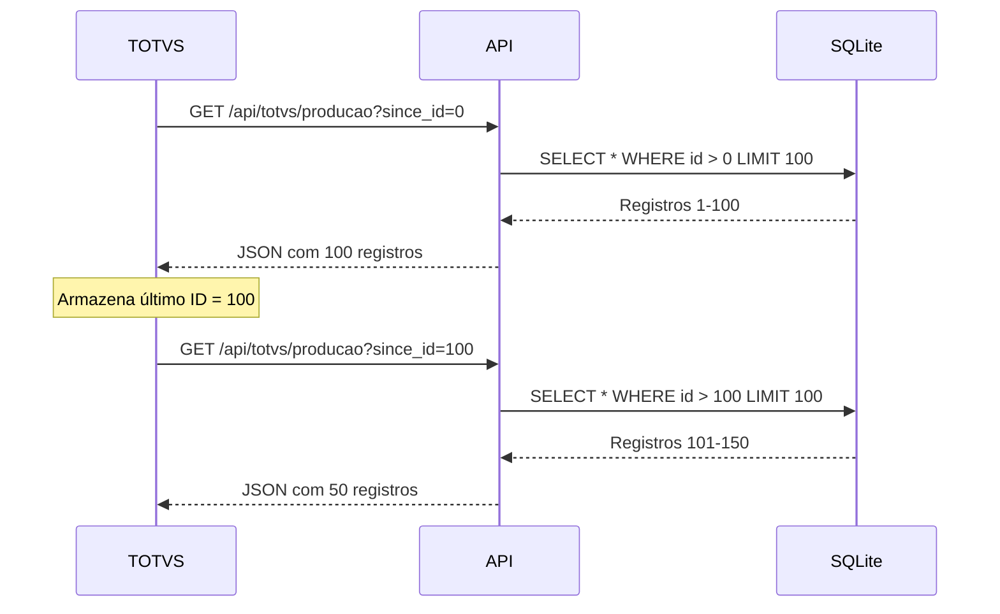

# Integração com TOTVS

Este guia detalha como integrar o sistema de monitoramento PLC com o **ERP TOTVS**.

---

## Visão Geral da Integração

O sistema oferece um endpoint dedicado (`/api/totvs/producao`) otimizado para sincronização com o TOTVS, permitindo:

- ✅ **Sincronização Incremental**: Buscar apenas registros novos
- ✅ **Controle de Volume**: Limitar quantidade de registros por requisição
- ✅ **Rastreabilidade**: Cada registro possui ID único sequencial
- ✅ **Formato Padronizado**: JSON compatível com REST APIs

---

## Fluxo de Integração



---

## Estrutura de Dados

### Registro de Produção

Cada registro retornado contém:

```json
{
  "id": 1235,                           // ID único sequencial
  "timestamp": "2026-01-12 14:30:00",   // Data/hora da produção
  "machine_name": "Cupper_22",          // Linha de produção
  "coil_number": "284043",              // Número do lote/bobina
  "cups_produced": 12500,               // Quantidade produzida
  "consumption_type": "Baixa Completa", // Tipo de consumo
  "shift": "DIA (07-19)"                // Turno
}
```

### Mapeamento para TOTVS

Sugestão de mapeamento para tabelas do TOTVS:

| Campo API | Tabela TOTVS | Campo TOTVS | Observações |
|-----------|--------------|-------------|-------------|
| `id` | - | - | Usar para controle de sincronização |
| `timestamp` | `SC2` (OP) | `C2_DATPRF` | Data de produção |
| `machine_name` | `SH1` (Recurso) | `H1_CODIGO` | Código do recurso |
| `coil_number` | `SC2` | `C2_NUM` | Número da OP |
| `cups_produced` | `SC2` | `C2_QUANT` | Quantidade produzida |
| `shift` | `SH6` (Turno) | `H6_CODIGO` | Código do turno |

---

## Implementação no TOTVS

### 1. Configuração Inicial

No TOTVS, crie uma tabela customizada para controlar a sincronização:

```sql
CREATE TABLE ZZ_SYNC_PLC (
    ZZ_TABELA VARCHAR(10),     -- Nome da tabela sincronizada
    ZZ_ULTIMO_ID INTEGER,      -- Último ID sincronizado
    ZZ_DATA DATETIME,          -- Data da última sincronização
    ZZ_STATUS VARCHAR(1)       -- Status (A=Ativo, E=Erro)
)
```

### 2. Rotina de Sincronização (AdvPL)

```advpl
#Include "Protheus.ch"
#Include "RestFul.ch"

/*/{Protheus.doc} SYNCPLC
Sincroniza dados de produção do sistema PLC
@type function
@author Victor Nascimento
@since 12/01/2026
/*/
User Function SYNCPLC()
    Local cUrl := "http://10.81.5.219:15789/api/totvs/producao"
    Local nUltimoId := GetUltimoId()
    Local oRest := FWRest():New(cUrl)
    Local cResponse := ""
    Local oJson
    Local nI
    
    // Adiciona parâmetros
    oRest:SetPath(cUrl + "?limit=100&since_id=" + cValToChar(nUltimoId))
    
    // Executa requisição
    If oRest:Get()
        cResponse := oRest:GetResult()
        oJson := JsonObject():New()
        oJson:FromJson(cResponse)
        
        // Processa cada registro
        For nI := 1 To Len(oJson:results)
            ProcessaRegistro(oJson:results[nI])
        Next nI
        
        // Atualiza último ID
        If Len(oJson:results) > 0
            AtualizaUltimoId(oJson:results[Len(oJson:results)]:id)
        EndIf
        
        ConOut("[SYNCPLC] Sincronizados " + cValToChar(oJson:count) + " registros")
    Else
        ConOut("[SYNCPLC] Erro: " + oRest:GetLastError())
    EndIf
    
Return

Static Function GetUltimoId()
    Local cQuery := ""
    Local nId := 0
    
    cQuery := "SELECT ZZ_ULTIMO_ID FROM " + RetSqlName("ZZ_SYNC_PLC")
    cQuery += " WHERE ZZ_TABELA = 'PLC_PROD' AND D_E_L_E_T_ = ' '"
    
    cQuery := ChangeQuery(cQuery)
    dbUseArea(.T., "TOPCONN", TCGenQry(,,cQuery), "TMP", .F., .T.)
    
    If !TMP->(Eof())
        nId := TMP->ZZ_ULTIMO_ID
    EndIf
    
    TMP->(DbCloseArea())
    
Return nId

Static Function ProcessaRegistro(oReg)
    // Implementar lógica de gravação na SC2, SH1, etc.
    // Exemplo simplificado:
    
    RecLock("SC2", .T.)
    SC2->C2_FILIAL  := xFilial("SC2")
    SC2->C2_NUM     := oReg:coil_number
    SC2->C2_QUANT   := oReg:cups_produced
    SC2->C2_DATPRF  := CtoD(SubStr(oReg:timestamp, 1, 10))
    SC2->C2_RECURSO := IIf(oReg:machine_name == "Cupper_22", "REC001", "REC002")
    MsUnlock()
    
Return

Static Function AtualizaUltimoId(nNovoId)
    dbSelectArea("ZZ_SYNC_PLC")
    RecLock("ZZ_SYNC_PLC", .F.)
    ZZ_SYNC_PLC->ZZ_ULTIMO_ID := nNovoId
    ZZ_SYNC_PLC->ZZ_DATA := DateTime()
    MsUnlock()
Return
```

### 3. Agendamento

Configure o **Job Scheduler** do TOTVS para executar a rotina:

- **Frequência**: A cada 5 minutos
- **Horário**: 24/7
- **Função**: `U_SYNCPLC`

---

## Tratamento de Erros

### Cenários Comuns

!!! warning "Sistema PLC Offline"
    **Sintoma**: Timeout na requisição HTTP
    
    **Solução**:
    ```advpl
    If !oRest:Get()
        // Registrar erro no log
        ConOut("[SYNCPLC] Sistema PLC offline")
        // Enviar email para TI
        U_EnviaAlerta("PLC Offline", oRest:GetLastError())
        // Aguardar próxima execução
        Return
    EndIf
    ```

!!! warning "Dados Duplicados"
    **Sintoma**: Registros com mesmo ID sendo processados
    
    **Solução**: Implementar verificação antes de gravar:
    ```advpl
    dbSelectArea("SC2")
    dbSetOrder(1) // C2_FILIAL + C2_NUM
    If !dbSeek(xFilial("SC2") + oReg:coil_number)
        // Gravar apenas se não existir
        RecLock("SC2", .T.)
        // ...
    EndIf
    ```

---

## Monitoramento

### Dashboard de Sincronização

Crie uma consulta SQL no TOTVS para monitorar:

```sql
SELECT 
    ZZ_TABELA AS 'Tabela',
    ZZ_ULTIMO_ID AS 'Último ID',
    ZZ_DATA AS 'Última Sync',
    DATEDIFF(MINUTE, ZZ_DATA, GETDATE()) AS 'Minutos Atrás',
    ZZ_STATUS AS 'Status'
FROM ZZ_SYNC_PLC
WHERE D_E_L_E_T_ = ' '
```

### Alertas Recomendados

Configure alertas para:

- ⚠️ Sincronização parada há mais de 10 minutos
- ⚠️ Erros consecutivos (3+)
- ⚠️ Diferença grande entre último ID local e remoto

---

## Health Check

Use o endpoint `/api/health` para verificar se o sistema está operacional antes de sincronizar:

```advpl
User Function CheckPLC()
    Local oRest := FWRest():New("http://10.81.5.219:15789/api/health")
    Local oJson
    
    If oRest:Get()
        oJson := JsonObject():New()
        oJson:FromJson(oRest:GetResult())
        
        If oJson:status == "OK"
            Return .T.
        EndIf
    EndIf
    
Return .F.
```

---

## Boas Práticas

!!! tip "Performance"
    - Use `limit=100` para evitar timeouts
    - Execute a sincronização fora do horário de pico
    - Implemente cache local se necessário

!!! tip "Segurança"
    - Configure firewall para permitir apenas IP do servidor TOTVS
    - Considere implementar autenticação via API Key
    - Use HTTPS em produção

!!! tip "Auditoria"
    - Registre todas as sincronizações em log
    - Mantenha histórico de erros
    - Monitore volume de dados transferidos

---

## Suporte

Para dúvidas sobre a integração, contate:

**Victor Nascimento**  
Email: [victor.nascimento@canpack.com](mailto:victor.nascimento@canpack.com)
