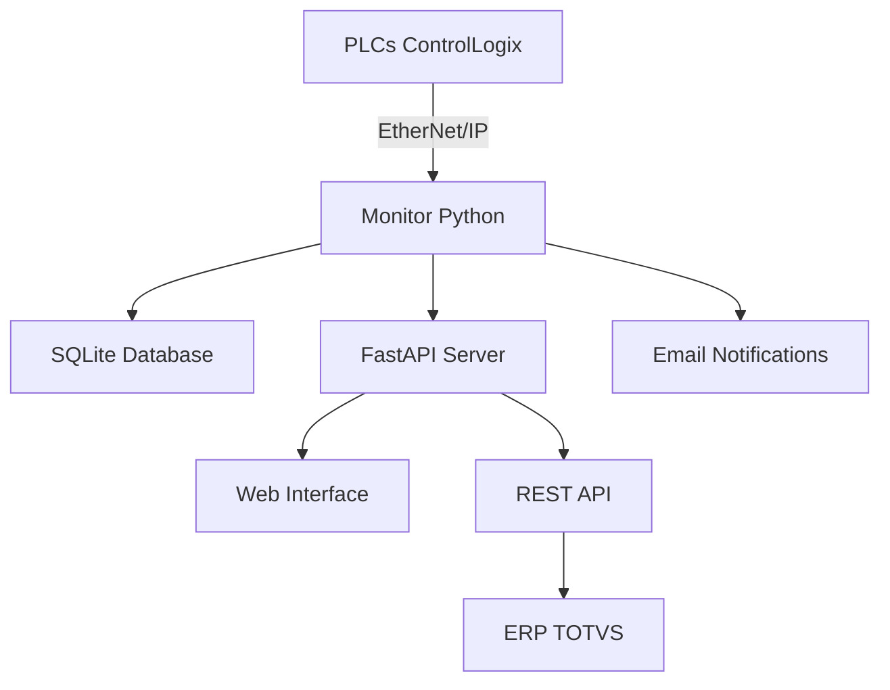

# Visão Geral do Sistema

## Introdução

O **Sistema de Monitoramento PLC** é uma solução completa para controle de produção industrial desenvolvida especificamente para as linhas Cupper da CANPACK Brasil.

---

## Arquitetura

### Componentes Principais

### Fluxo de Dados

1. **Coleta**: Sistema monitora tags dos PLCs via Pylogix
2. **Processamento**: Detecta eventos (troca de bobina, mudança de formato)
3. **Armazenamento**: Registra no SQLite com timestamp e turno
4. **Disponibilização**: Expõe via API REST para consumo
5. **Notificação**: Envia alertas por email quando necessário

---

## Funcionalidades

### Monitoramento em Tempo Real

- ✅ Conexão contínua com PLCs via EtherNet/IP
- ✅ Leitura de tags a cada 1 segundo
- ✅ Detecção automática de desconexão
- ✅ Reconexão automática com backoff exponencial

### Gestão de Lotes

- ✅ Interface web para inserção de códigos de barras
- ✅ Validação de formato (mínimo 6 dígitos)
- ✅ Rastreamento de bobinas de entrada/saída
- ✅ Histórico completo de movimentações

### Cálculo de Turnos

O sistema utiliza a seguinte regra:

| Turno | Horário |
|-------|---------|
| **DIA** | 07:00 - 18:59 |
| **NOITE** | 19:00 - 06:59 |

### Identificação de Formato

Baseado no valor de `Feed_Progression_INCH`:

| Formato | Feed Rate | Tolerância |
|---------|-----------|------------|
| 269ml_FIT | 5.1312 | ±0.0004 |
| 350ml_STD | 5.5848 | ±0.0004 |
| 473ml | 6.0768 | ±0.0004 |
| 550ml | 6.4304 | ±0.0004 |

---

## Tecnologias Utilizadas

### Backend

- **FastAPI** - Framework web moderno e rápido
- **Uvicorn** - Servidor ASGI de alta performance
- **Pylogix** - Comunicação com PLCs Allen-Bradley
- **SQLite** - Banco de dados embutido

### Frontend

- **HTML5/CSS3** - Interface responsiva
- **JavaScript** - Interatividade
- **TailwindCSS** - Estilização moderna

### Infraestrutura

- **Python 3.13** - Linguagem base
- **NSSM** - Execução como serviço Windows
- **Git** - Controle de versão

---

## Próximos Passos

- [Instalação](installation.md)
- [Configuração](configuration.md)
- [API Reference](../api/endpoints.md)
