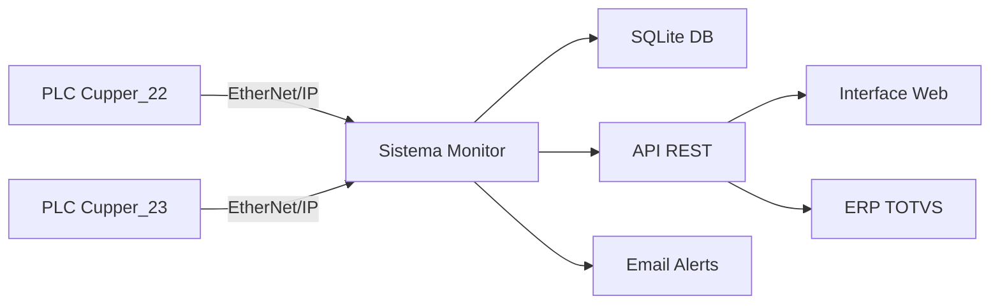

# 🚀 Sistema de Monitoramento PLC - CANPACK Brasil

<div class="grid cards" markdown>

-   :material-clock-fast:{ .lg .middle } __Tempo Real__

    ---

    Monitoramento contínuo das linhas de produção Cupper_22 e Cupper_23 com atualização instantânea de dados

    [:octicons-arrow-right-24: Ver Dashboard](http://10.81.5.219:15789)

-   :material-database:{ .lg .middle } __Histórico Completo__

    ---

    Armazenamento automático de toda produção com rastreabilidade por lote, turno e bobina

    [:octicons-arrow-right-24: Consultar Relatórios](api/endpoints.md#relatorios-de-producao)

-   :material-api:{ .lg .middle } __API REST__

    ---

    Integração facilitada com ERP TOTVS através de endpoints otimizados e documentados

    [:octicons-arrow-right-24: Ver API Docs](http://10.81.5.219:15789/docs)

-   :material-shield-check:{ .lg .middle } __Alta Confiabilidade__

    ---

    Sistema robusto com backup automático, fallback inteligente e recuperação de falhas

    [:octicons-arrow-right-24: Saiba Mais](backup.md)

</div>

---

## Visão Geral

Este sistema de **monitoramento industrial** foi desenvolvido especificamente para a **CANPACK Brasil**, permitindo o controle completo do ciclo de vida das bobinas nas linhas de produção de copos.

### Principais Funcionalidades

=== "Monitoramento"

    - ✅ Conexão em tempo real com PLCs via EtherNet/IP
    - ✅ Detecção automática de troca de bobinas
    - ✅ Cálculo de produção por turno (DIA/NOITE)
    - ✅ Identificação de formato de copo por Feed Rate
    - ✅ Alertas automáticos por email

=== "Gestão de Lotes"

    - ✅ Interface web para inserção de códigos de barras
    - ✅ Validação de lotes com mínimo de 6 dígitos
    - ✅ Rastreamento de bobinas de entrada e saída
    - ✅ Histórico completo de movimentações
    - ✅ Notificações de mudança de lote

=== "Integração ERP"

    - ✅ Endpoint dedicado para TOTVS
    - ✅ Sincronização incremental via `since_id`
    - ✅ Formato JSON padronizado
    - ✅ Health check para monitoramento
    - ✅ Documentação OpenAPI/Swagger

---

## Início Rápido

### Acessar o Sistema

```bash
# Interface Web
http://10.81.5.219:15789

# Documentação Interativa (Swagger)
http://10.81.5.219:15789/docs

# Health Check
http://10.81.5.219:15789/api/health
```

### Exemplo de Uso da API

=== "Python"

    ```python
    import requests

    # Consultar status de uma linha
    response = requests.get('http://10.81.5.219:15789/api/lote/Cupper_22')
    data = response.json()
    
    print(f"Lote Atual: {data['lote_atual']}")
    print(f"Produção: {data['producao_total_acumulada']} copos")
    ```

=== "JavaScript"

    ```javascript
    // Buscar dados de todas as linhas
    fetch('http://10.81.5.219:15789/api/lotes')
      .then(response => response.json())
      .then(data => {
        console.log('Total de PLCs:', data.total_plcs);
        console.log('Lotes:', data.lotes);
      });
    ```

=== "cURL"

    ```bash
    # Sincronização TOTVS
    curl -X GET "http://10.81.5.219:15789/api/totvs/producao?limit=50&since_id=100"
    ```

---

## Arquitetura do Sistema



---

## Tecnologias

<div class="grid" markdown>

:fontawesome-brands-python: **Python 3.13**
{ .card }

:simple-fastapi: **FastAPI**
{ .card }

:material-database: **SQLite**
{ .card }

:material-api: **Pylogix**
{ .card }

</div>

---

## Suporte

!!! info "Contato Técnico"
    **Responsável:** Victor Nascimento Silva  
    **Email:** [victor.nascimento@canpack.com](mailto:victor.nascimento@canpack.com)  
    **Departamento:** Tecnologia - CANPACK Brasil

---

<div class="result" markdown>

[:octicons-arrow-right-24: Começar Agora](guide/overview.md){ .md-button .md-button--primary }
[:octicons-book-24: Ver API Docs](http://10.81.5.219:15789/docs){ .md-button }

</div>
